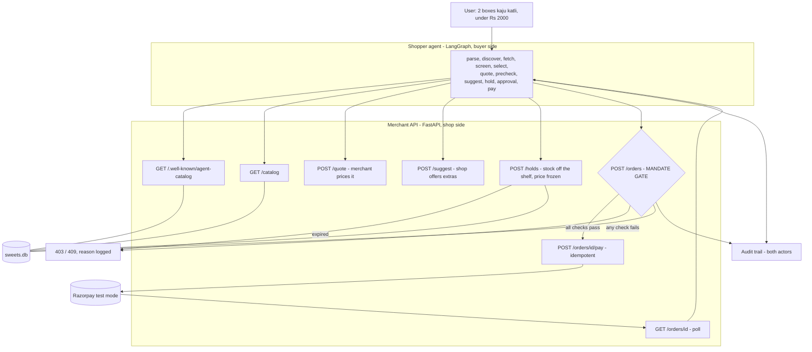
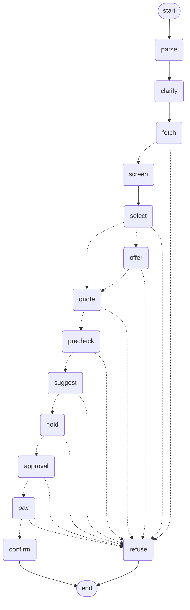

# Architecture

A merchant that an AI buyer can purchase from unattended, with spending
authority enforced on the merchant's side.

## System

Two independent processes. The agent belongs to the buyer; the merchant trusts
nothing it sends. They communicate only over HTTP — the agent has no access to
the merchant's database or code.

The agent is given **one URL**. Endpoint paths, currency, delivery fee,
category list and reservation policy are all read from the manifest at
runtime, so the same agent works against any merchant publishing it.

## Agent graph

Eight of the fourteen nodes can route to `refuse`. Every one of them writes its
reason to the audit trail before doing so.

Three nodes pause for a human: `clarify` (was that budget per item or total?),
`offer` (what you asked for doesn't fit — take this instead?), and `approval`
(pay this, with or without the suggested extra?).

## Design decisions

**The mandate gate is on the merchant, not the agent.** The agent belongs to
the buyer and may be buggy, hijacked, or hostile. The merchant is the party
releasing goods, so it performs the authoritative check. The agent's own checks
are a courtesy to the user — fast feedback, no wasted round trips — and
deleting them would not make the system unsafe. Verified by calling
`POST /orders` with curl and no agent at all: still refused. The UI's
"misbehaving agent" switch turns the agent's own checks off precisely so the
merchant's refusal is visible rather than pre-empted.

**The merchant computes every total.** Callers send product ids and quantities.
A caller-supplied price is ignored — every basket is re-priced from the
database inside `/quote`, `/holds` and `/orders`, so a broken agent cannot
understate a cart.

**A mandate is a budget, not a per-transaction limit.** `/orders` sums what the
mandate has already committed and refuses when this order would take it past
its cap. `GET /mandates/{id}` exposes `spent_paise` and `remaining_paise`, so
the buyer can shop against what is left and refuse *before* troubling a human
for an approval the merchant is certain to reject.

**Stock is moved by the database, not by the application.** Every movement is a
single conditional statement — `UPDATE products SET stock = stock - :qty WHERE
id = :id AND stock >= :qty`. If two agents reach for the last box at the same
instant, one row count comes back 1 and the other 0. No application locking,
and the same code is correct on SQLite and Postgres.

**A reservation separates deciding from paying.** A human at an approval gate
takes time, and in that time a shop can sell out or reprice. `POST /holds`
takes the items off the shelf and freezes the total for a declared TTL, so the
number a person approves is the number they pay. Holds expire on their own and
return their stock; the sweep runs on any hold or order request, so no
background job is needed.

**The LLM never touches money.** It parses intent and selects products. Totals,
limits and authorisation are deterministic code. A model cannot be argued out
of an `if` statement.

**Model output is validated, not trusted.** Every selected line must have a real
id, a whole quantity of at least one, enough stock, and must keep the basket
inside the limit. It must also plausibly *be what the user asked for* — matched
against the catalog's own names and aliases — because a prompt instruction not
to substitute is a request, not a control.

**Matching belongs to the catalog.** Aliases, regional names and units are
catalog fields rather than model knowledge, so "cashew barfi" and "ಕಾಜು ಕತ್ಲಿ"
resolve without depending on which model happens to be reading.

**Product text is data, not instruction.** Reviews are screened for imperative
patterns before reaching the model, and whatever survives is passed as
explicitly untrusted content.

**Every mandate is verified the same way.** A passkey-approved mandate carries
a WebAuthn assertion *and* an HMAC over its terms. The assertion proves a human
approved it; the HMAC proves the stored terms were not edited afterwards. There
is no path through `/orders` that skips the signature check.

**Suggesting is not selling.** The merchant declares which products pair with
which and offers them through `/suggest`. The buyer filters every offer against
the mandate's categories and remaining budget before a human sees it, the
reservation covers the extra so it cannot vanish mid-decision, and only a human
accepts. An accepted extra is authorised exactly like anything else.

**The audit trail is not open to strangers.** The buyer's agent narrates its own
reasoning into the trail, which is useful because half the story happens on its
side — but a write requires a valid mandate, so the record cannot be forged by
anyone who merely knows the URL.

**Money is integer paise.** No floats anywhere in the money path.

**Orders and payments are idempotent.** `POST /orders` honours an
`Idempotency-Key`; one order yields one payment link, ever. A retried request
returns what already exists rather than creating a second.
