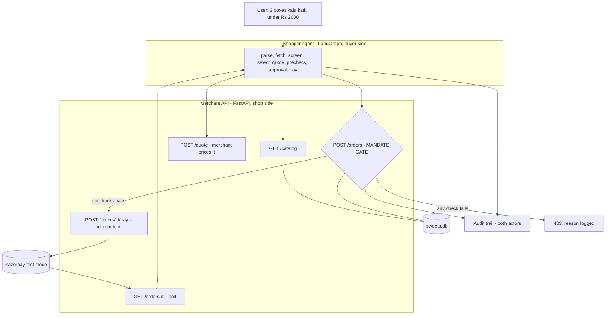
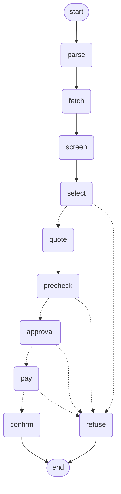

# Architecture

A merchant that an AI buyer can purchase from unattended, with spending
authority enforced on the merchant's side.

## System

Two independent processes. The agent belongs to the buyer; the merchant
trusts nothing it sends. They communicate only over HTTP — the agent has
no access to the merchant's database or code.

## Agent graph

Generated from the code with `graph.get_graph().draw_mermaid()`.

Four of the nine nodes can route to `refuse`. Every one of them writes
its reason to the audit trail before doing so.

## Design decisions

**The mandate gate is on the merchant, not the agent.** The agent belongs
to the buyer and may be buggy, hijacked, or hostile. The merchant is the
party releasing goods, so it performs the authoritative check. The
agent's own cap check is a fast-fail only — deleting it would not make
the system unsafe. Verified by calling `POST /orders` with curl and no
agent at all: still refused.

**The merchant computes every total.** Callers send product ids and
quantities. A caller-supplied price is ignored. `price_items()` re-prices
from the database inside `/orders`, so a broken agent cannot understate a
cart.

**The LLM never touches money.** It parses intent and selects products.
Totals, limits and authorisation are deterministic code. A model cannot
be argued out of an `if` statement.

**Product text is data, not instruction.** Reviews are screened for
imperative patterns before reaching the model, and whatever survives is
passed as explicitly untrusted content.

**Money is integer paise.** No floats anywhere in the money path.

**Payment is idempotent.** One order yields one payment link, ever. A
retried request returns the existing link.